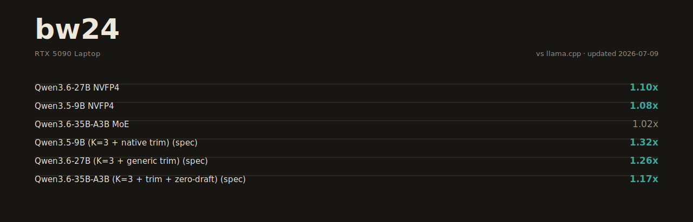

# bw24

[](LICENSE)


-black.svg)



From-scratch LLM inference engine in Rust + CUDA, built for one machine: an RTX 5090 Laptop (Blackwell sm_120a, 24 GB, 175 W with dynamic boost). No frameworks, no ggml — every kernel written and tuned against measured hardware limits, with llama.cpp as the benchmark to beat on the same rig.

The [Performance](#performance) section and card above show same-session measurements against llama.cpp's best config. Primary format: **GGUF NVFP4** (chosen 2026-07-10 on long-context serving reliability). HF safetensors checkpoints also load directly — supported best-effort, see the note under Performance.

## Why this project

- Real, running inference on sm_120a (consumer Blackwell), with every shipped optimization backed by its measured win/loss record.
- Gated on bit-exactness — argmax match and speculative self-consistency, verified on every kernel change.
- Runs Qwen3.5/3.6 dense and MoE checkpoints on 24 GB — GGUF first-class, HF safetensors supported — including models far larger than VRAM+RAM.

## Requirements

- NVIDIA Blackwell consumer GPU (sm_120a). Primary target: RTX 5090 Laptop.
- CUDA toolkit 13.1 (the build default — `crates/bw24-engine/build.rs` uses `/usr/local/cuda-13.1/bin/nvcc`; override with `BW24_NVCC=/path/to/nvcc`).
- Rust (edition 2024), [cudarc](https://github.com/coreylowman/cudarc) 0.19 with dynamic loading.
- A model — GGUF or an HF safetensors directory (pass either path). Tested: Qwen3.5-9B, Qwen3.6-27B, Qwen3.6-35B-A3B MoE (common quants), nvidia/Qwen3.6-27B-NVFP4, MiniMax-M3 REAP50, Hy3-REAP50.

## Quick start

```bash
# build
cargo build --release

# verify all kernels against the CPU reference
./target/release/kernel-check

# generate text (the fast path is the default — no flags needed)
BW24_CHAT=1 ./target/release/run-gen /path/to/model.gguf --prompt "Explain KV caches in one paragraph."

# speculative decoding with the embedded MTP draft head (Qwen3.6)
BW24_SPEC_K=3 ./target/release/run-spec /path/to/qwen36-27b.gguf

# OpenAI-compatible server
./target/release/bw24-server
```

Every tuned kernel path is the default; environment flags exist only for runtime parameters (prompt, draft depth, trims), machine-specific configuration, and rollback seams (`BW24_FAST=0` drops to the f32 oracle path). The catalog lives in `docs/FLAGS.md`.

`run-gen` prints a prefill/decode correctness gate (prefill argmax must match decode argmax) before timing anything — if that line says MISMATCH, the numbers after it don't count.

## Workspace layout

| Crate | What it does |
|---|---|
| `bw24-engine` | Core: CUDA kernels (`cu/`), forward passes, speculative decoding, MoE cache, CUDA-graph decode |
| `bw24-gguf` | GGUF parser + tensor loading (memory-mapped) |
| `bw24-tokenizer` | BPE tokenizer + chat templates from GGUF metadata |
| `bw24-runtime` | CUDA device/stream/memory primitives over cudarc |
| `bw24-server` | HTTP server (axum), OpenAI-compatible `/v1` endpoints |
| `bw24-probe` | Standalone hardware microbenches (`probe/*.cu`: bandwidth, tensor-core peaks, layout experiments) |

## What's inside

- **NVFP4 (W4) decode path** — block-scaled FP4 matvec with split-plane repack, warp-level dp4a, and an int8 W4A8 tensor-core GEMM for prefill. Auto-dispatches per matrix shape.
- **MTP speculative decoding** — draft with the model's embedded multi-token-prediction head, verify K+1 tokens in one batched target forward. The whole draft chain runs inside a captured CUDA graph; exactness is enforced by a K=1..8 self-consistency gate (all K must emit identical tokens).
- **MoE on 24 GB** — expert-major CSR batching, decode-once dequant kernels, int8 tensor-core expert GEMM, and an SLRU expert-residency cache with VRAM → host → disk spill.
- **FlashAttention-style kernels** — fused prefill and decode attention with quantized KV (q8_0 K / q5_1 V default; FP8 and q4_0 arms exist behind flags — q4_0 V measured quality-taxed and stays off), register-resident dequant, split-K for long context.
- **CUDA-graph decode** — the full per-token decode is one graph replay; per-step host round-trip is 4 bytes.
- **Hybrid architectures** — full-attention + gated-delta-net (SSM) layer mixes, as in Qwen3.6.
- **Safetensors loader** — HF checkpoints load directly (no GGUF conversion): modelopt NVFP4 repacks byte-exact into the GGUF block layout, FP8-E4M3 and large-BF16 tensors re-encode to Q8_0/NVFP4 at load, V-head permutations apply on packed bytes, MoE experts stream through a disk-tier repack cache for models far bigger than VRAM+RAM.
- **Sigmoid-router MoE** (MiniMax/DeepSeek-style) — e_score_correction_bias selection, swigluoai activation, gate-optional attention; with the measured law that cross-kernel-family FP-order differences are architectural on discontinuous top-k routing (exactness binds within a config).

## Correctness discipline

Every kernel change must pass, in order:
1. `kernel-check` — every quant kernel vs a CPU reference.
2. `run-gen` argmax gate — prefill and decode paths must agree on the next token.
3. `run-spec` self-consistency — speculative output at K=1..8 must be token-identical to plain decode.

Floating-point summation order is part of the contract: two mathematically equal kernels that reduce in different orders can flip an argmax at tight logit margins. Several "faster" kernels were rejected for exactly this (`research/tune-data/`).

## Performance

<!-- PERF-DATE:START (generated by tools/update-perf-board.py — do not hand-edit; edit research/tune-data/current-board.json instead) -->
Measured 2026-07-10 on the target rig (RTX 5090 Laptop, N=2 medians, engines interleaved per model in the same hour-regime, idle-gated cold starts, no flags (tuned paths are defaults); rebaseline2 campaign + 35B spec refresh 2026-07-10 (router GEMV + CSR gate_up dedup; H-runs, N=2, 1590MHz/58-65C, idle GPU, llama = marked 07-09 floor), 27B p1/p2 re-paired 2026-07-10 (I-runs: same-session interleaved N=2, idle GPU; p3 sampled pair unchanged), raw logs in research/tune-data/rebaseline-logs/) against llama.cpp built on the same machine, same exact prompts, both engines re-baselined the same day. Boards move with the tuning campaign — `research/tune-data/rig5090.jsonl` is the running record; the README is refreshed with every board-moving merge.
<!-- PERF-DATE:END -->

**Plain decode first** (no speculation, tg128 at 512-token context — the honest floor comparison):

<!-- PERF-PLAIN:START (generated by tools/update-perf-board.py — do not hand-edit; edit research/tune-data/current-board.json instead) -->
| Model | bw24 plain | llama.cpp plain | Ratio |
|---|---|---|---|
| Qwen3.5-9B NVFP4 (GGUF) | 135.7 | 126.7 | **1.07x** |
| Qwen3.6-27B NVFP4 (GGUF) | 48.4 | 44.9 | **1.08x** |
| Qwen3.6-35B-A3B MoE (IQ4_XS) | 178.2 | 167.8 | **1.06x** |
<!-- PERF-PLAIN:END -->

Depth is part of the contract: at 6.3k-token context every lead holds (1.02-1.09x). Every attention/split change validates across the depth axis, not just one point.

**Speculative decoding** (MTP head, both engines at their measured best config) as the bonus layer on top:

<!-- PERF-SPEC:START (generated by tools/update-perf-board.py — do not hand-edit; edit research/tune-data/current-board.json instead) -->
| Model | bw24 spec | llama.cpp spec-best | Ratio |
|---|---|---|---|
| Qwen3.5-9B (K=3 + native trim) | 238.9 / 210.2 / 212.0 | 123.6 / 122.6 / 119.2 | **1.93x** / **1.71x** / **1.78x** |
| Qwen3.6-27B (K=3 + draft + code75 trim) | 107.3 / 95.4 / 103.5 | 86.3 / 91.7 / 93.4 | **1.24x** / 1.04x / **1.11x** |
| Qwen3.6-35B-A3B (K=3 + trim + zero-draft) | 293.6 / 233.1 / 265.9 | 251.9 / 221.4 / 248.9 | **1.17x** / **1.05x** / **1.07x** |
<!-- PERF-SPEC:END -->

The three columns are short-code / medium-code (greedy temp-0, the field-standard bounded protocol) / long-agentic **sampled** (temperature 0.7, seeded, chat-templated — bw24's rejection-sampling speculative decode, distribution-exact per the Leviathan/Chen theorem, gated on seeded-rerun identity; llama serves at the matched temperature). The sampled column replaced the old raw-greedy one after a text audit showed greedy long-form continuations degenerate into repetition loops on every engine — sampling is how production serves, and it is what gets measured. The speculative edge comes from three mechanisms — FR-Spec vocabulary trims, whole-round confidence gating, and per-content-class draft depth — detailed in [`HANDOVER.md`](HANDOVER.md).

**Reproducing:** every artifact is public — trimmed draft-head GGUFs, exact prompts, and full configs at [huggingface.co/Avifenesh/bw24-bench](https://huggingface.co/Avifenesh/bw24-bench). llama.cpp build/serve flags are in [docs/COMPETITOR-SETUP.md](docs/COMPETITOR-SETUP.md); the harness is `research/e2e/run-e2e.sh`.

**Known gaps** (tracked and diagnosed in `research/tune-data/`): prefill trails llama.cpp at 0.59-0.78x — **root-caused 2026-07-10**: llama benches NVFP4 prefill at W4A4 (FP4 activations, the 762-TF tensor class; visible as `quantize_mmq_nvfp4` in its own profile), a numeric class bw24's exactness gates reject for greedy decoding (bw24's in-tree W4A4 arm beats llama 1.03-1.06x but forks argmax on long prompts — `docs/FLAGS.md` §5). The residual is a deliberate quality choice: bw24 could match llama's prefill by adopting the same activation class and chooses not to — output quality outranks the prefill column. Also: the 27B medium-code spec cell sits just under parity (0.95x — llama's MTP serve is strong exactly there), and vLLM's batched MTP wins on big-VRAM boxes.

**Safetensors support (best-effort note):** the ST loader runs checkpoints llama.cpp cannot — NVIDIA's official Qwen3.6-27B-NVFP4 (with its own tuned serve config incl. the W4A8-FP8 prefill tile) and giant spilled MoEs (MiniMax-M3 REAP50 121 GB, Hy3-REAP50 82 GB) through VRAM→RAM→NVMe tiers. GGUF is the primary, board-published format: the 2026-07-10 head-to-head found ST at plain/pp parity-or-better but seed-sensitive repetition on long-context sampling, and long-context serving is this project's primary workload (`research/tune-data/27b-st-vs-gguf-final.md`). ST configs stay published on the HF bench repo.

## Limitations

- Built for sm_120a only; tuning choices assume this exact memory/compute ratio.
- Model coverage: Qwen3.5/3.6 dense and MoE, MiniMax-M3, Hy3 — not a general GGUF runner.
- Single GPU, single stream. No tensor parallelism, no continuous batching.
- APIs and flags change without notice; moving research codebase.

## Docs

- [`ARCHITECTURE.md`](ARCHITECTURE.md) — tech stack + sm_120a feasibility ledger (what the silicon can and cannot do, measured).
- [`HANDOVER.md`](HANDOVER.md) — the living state-of-work doc (current standings, laws, open lanes); internal but readable.
- [`docs/decisions/`](docs/decisions/) — design decision records: internal weight format, quant/GEMM policy, safetensors import, hybrid-architecture plan.
- [`docs/COMPETITOR-SETUP.md`](docs/COMPETITOR-SETUP.md) — how each competitor engine is built and tuned to its peak on this box (the "beat them at their best" contract).
- [`research/tune-data/current-board.json`](research/tune-data/current-board.json) — the numbers behind the Performance section and `docs/perf-card.svg`, both regenerated by [`tools/update-perf-board.py`](tools/update-perf-board.py) — edit the JSON, never the generated regions directly.
- [`research/sm120-empirical-capabilities.md`](research/sm120-empirical-capabilities.md) — microbenched silicon peaks for this GPU.
- [`research/benchmarks.md`](research/benchmarks.md) — the A/B measurement protocol.
- [`research/tune-data/`](research/tune-data/) — every tuning experiment as JSONL: config → measured result, wins and losses both. ~215 records and counting; treat it as a labeled corpus of what sm_120a actually rewards.

## Contributing

Issues and PRs welcome — see [CONTRIBUTING.md](CONTRIBUTING.md).

## License

MIT — see [LICENSE](LICENSE).
