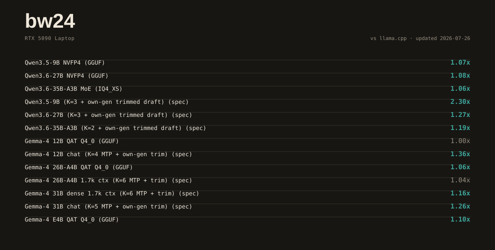

# bw24 — from-scratch LLM inference for RTX 5090 (sm_120a) and H100 (sm_90a)

[](https://github.com/avifenesh/bw24/actions/workflows/ci.yml)
[](LICENSE)




From-scratch LLM inference engine in Rust + CUDA — no frameworks, no ggml. One codebase
serves two architectures, auto-detected at build time: **RTX 50-series Blackwell
(sm_120a)**, tuned single-user against llama.cpp, and **H100 Hopper (sm_90a)**, a
multi-tenant serving lane measured against vLLM on the same box. Every kernel is
hand-written against measured hardware limits, and exactness is the contract: speculative
and graph-replay output is gated token-identical to plain decode, so speed never changes
what the model says.

**Use bw24 when** you serve one model on an RTX 50-series card and want measured,
exactness-gated speed, or you want a single-GPU H100 serving engine with lane scheduling
and per-request accounting. **Use something else when** you have another GPU
([llama.cpp](https://github.com/ggml-org/llama.cpp),
[mistral.rs](https://github.com/EricLBuehler/mistral.rs)) or need multi-GPU serving
(vLLM, SGLang).

**Standing (2026-07-28):** seven supported models on the 5090, all fully gated, no plain
cell below llama.cpp; Qwen leads every cell (plain 1.06–1.08x, MTP spec 1.06–2.30x),
Gemma spec leads up to 1.54x. On the H100, decode beats vLLM w8a8 at 122.8% same-session;
prefill stands at 73–79% with the remaining gap mechanism-priced (see below). Every
number is a same-session interleaved measurement; trimmed MTP drafter heads are published
ready-to-use at [huggingface.co/Avifenesh/bw24-bench](https://huggingface.co/Avifenesh/bw24-bench).

Running bw24 on your own rig? A [hardware validation
report](.github/ISSUE_TEMPLATE/hardware-validation.md) is the fastest way to help.

## One engine, two architectures

```bash
cargo build --release   # BW24_CUDA_ARCH auto-detected from the GPU (120a / 90a / 100a / 89)
```

The build probes the GPU's compute capability and selects the arch; `BW24_CUDA_ARCH`
overrides. At startup the engine verifies the binary matches the device and fails early
with a rebuild hint otherwise (`BW24_ARCH_CHECK=0` bypasses). Hopper-only promotions
(wgmma/TMA kernels, graph serving defaults) are compile-gated — the naked sm_120a build
is byte-for-byte the tuned 5090 engine.

## The H100 lane (sm_90a)

Multi-tenant serving on 1×H100 80GB against vLLM 0.26 w8a8, same box, same session
(2026-07-27, N=5 medians, 2048-token prompt, 512 gen):

| lane | bw24 | vLLM w8a8 | ratio |
|---|---:|---:|---:|
| decode tok/s | **220.5** | 179.5 | **122.8%** |
| serving decode (GraphSession) | **233.6** | — | — |
| single-seq prefill tok/s | 26,290 | 35,986 | 73% |
| serving burst prefill (16× 937-tok) | 27,364 aggregate | — | — |

Decode wins on exact math. The prefill gap is precisely priced: vLLM rides INT8
tensor-core GEMMs; a Q8_0-exact int8 GEMM is mechanism-refuted on Hopper (per-32-block
rescale costs 5.4x naive / 17x pipelined — ptxas serializes cross-bank GMMA register
reads), so closing it means w8a8-class numerics that change model outputs — an
accuracy-bar decision, not an engineering gap.

Shipped on this lane: FA3-class prefill attention (TMA swizzled ring + wgmma, 4.8x the
mma kernel), fused wgmma GDN chunk kernels with varlen twins, cross-request prefill
batching, per-session CUDA-graph decode, lane scheduling (interactive/judge/harvest with
per-lane prefill budgets), and the Hopper wgmma toolkit
([`cu/wgmma_common.cuh`](crates/bw24-engine/cu/wgmma_common.cuh)) — canonical
core-matrix pairings probed for bf16/tf32/s8: one byte-geometry, three MMA kinds.

- Evidence ledger (every verdict and refutation): [ARCHITECTURE-H100.md](ARCHITECTURE-H100.md)
- Flags + promoted defaults: [docs/FLAGS.md §7](docs/FLAGS.md)
- One-command battery: `tools/validate-h100.sh <model.gguf> [--quick]`

## Model support

| Tier | Models | State |
|---|---|---|
| **Supported** | Qwen3.5-9B, Qwen3.6-27B, Qwen3.6-35B-A3B MoE (NVFP4/IQ4_XS); Gemma-4 12B, 26B-A4B MoE, 31B, E4B (QAT Q4_0 + MTP drafters) | Board-published, fully gated, exactness-first |
| **Supported, under tuning** | Hy3 Layer103.5 overlay (VRAM→RAM→dual-NVMe spill) | Correctness-gated end-to-end; [docs/HY3-SPILL.md](docs/HY3-SPILL.md) |
| **In progress** | MiniMax-M3 REAP50 (safetensors spill) | Loads + generates; router tuning open |

## Quick start

Prebuilt Linux x86_64 binaries (sm_120a) ship with each
[release](https://github.com/avifenesh/bw24/releases) — or build from source:

```bash
cargo build --release
./target/release/kernel-check                     # every kernel vs CPU reference
BW24_CHAT=1 ./target/release/run-gen /path/to/model.gguf --prompt "Explain KV caches."
BW24_SPEC_K=3 ./target/release/run-spec /path/to/qwen36-27b.gguf   # MTP speculative
./target/release/run-gen hf:owner/repo:Q4_K_M --prompt "hi"        # auto-download from HF
./target/release/bw24-server                      # OpenAI-compatible /v1
```

`kernel-check` must end with `ALL GREEN`, and `run-gen` prints its argmax gate
(`... MATCH`) before generating — a MISMATCH voids every number after it. Tuned paths
are the defaults; flags exist only for runtime parameters, machine config, and rollback
seams ([docs/FLAGS.md](docs/FLAGS.md)).

## Performance — Qwen (NVFP4 / IQ4_XS), RTX 5090

<!-- PERF-DATE:START (generated by tools/update-perf-board.py — do not hand-edit; edit research/tune-data/current-board.json instead) -->
Measured 2026-07-27 on the target rig (RTX 5090 Laptop, N=2+ medians, both engines interleaved in the same thermal window on the same rig, same exact prompts, no flags (tuned paths are defaults); plain/depth rows from the 2026-07-09 validity-gated cold-start rebaseline, spec rows re-paired 2026-07-18, Gemma card rows from the 2026-07-15 best-vs-best re-audit. Full per-run logs: research/tune-data/ (Qwen) and research/gemma4-bringup/ (Gemma) — every win and every loss; Gemma 12B plain row from the 2026-07-24 official N=5 cell stamp (research/gemma4-bringup/g12tg-cellstamp.log)) against llama.cpp built on the same machine, same exact prompts, both engines re-baselined the same day. Boards move with the tuning campaign — `research/tune-data/rig5090.jsonl` is the running record; the README is refreshed with every board-moving merge.
<!-- PERF-DATE:END -->

**Plain decode** (no speculation, tg128 at 512-token context):

<!-- PERF-PLAIN:START (generated by tools/update-perf-board.py — do not hand-edit; edit research/tune-data/current-board.json instead) -->
| Model | bw24 plain | llama.cpp plain | Ratio |
|---|---|---|---|
| Qwen3.5-9B NVFP4 (GGUF) | 135.7 | 126.7 | **1.07x** |
| Qwen3.6-27B NVFP4 (GGUF) | 48.4 | 44.9 | **1.08x** |
| Qwen3.6-35B-A3B MoE (IQ4_XS) | 178.2 | 167.8 | **1.06x** |
<!-- PERF-PLAIN:END -->

Depth is part of the contract: at 6.3k-token context every lead holds (1.02–1.07x).

**Speculative decoding** (MTP head, both engines at their measured best):

<!-- PERF-SPEC:START (generated by tools/update-perf-board.py — do not hand-edit; edit research/tune-data/current-board.json instead) -->
| Model | bw24 spec | llama.cpp spec-best | Ratio |
|---|---|---|---|
| Qwen3.5-9B (K=3 + own-gen trimmed draft) | 281.0 / 211.7 / 187.1 | 122.2 / 121.5 / 117.7 | **2.30x** / **1.74x** / **1.59x** |
| Qwen3.6-27B (K=3 + own-gen trimmed draft) | 116.4 / 101.2 / 86.0 | 91.7 / 93.3 / 81.5 | **1.27x** / **1.08x** / **1.06x** |
| Qwen3.6-35B-A3B (K=2 + own-gen trimmed draft) | 280.6 / 259.6 / 258.0 | 236.5 / 174.6 / 173.5 | **1.19x** / **1.49x** / **1.49x** |
<!-- PERF-SPEC:END -->

The three columns are three prompt classes: short code / medium code (greedy) / long
agentic (temp 0.7, distribution-exact rejection sampling). One asterisk: the 35B
short-code llama bar (236.5) rode an EOS-margin flip and is not a clean win basis. Every
spec row uses one trimmed draft built by the standard regime
([docs/DRAFT-REGIME.md](docs/DRAFT-REGIME.md)); prebuilt drafts live in the
[bench repo](https://huggingface.co/Avifenesh/bw24-bench), or build your own:

```bash
./target/release/frspec-owngen model.gguf ranks.gguf 32768        # ranks from the model's OWN generations
tools/make-trimmed-draft.sh model.gguf ranks.gguf.txt draft.gguf  # extract + trim + quantize
```

## Performance — Gemma-4 (QAT Q4_0), RTX 5090

Same protocol, own campaign log
([`research/gemma4-bringup/rig5090-gemma4.jsonl`](research/gemma4-bringup/rig5090-gemma4.jsonl));
cells re-paired best-vs-best with llama's own draft depth swept per cell. Highlights
(full tables and the per-cell archaeology live in the campaign log):

| Cell | bw24 | llama.cpp | Ratio |
|---|---|---|---|
| 12B MTP spec, 1.7k ctx (K=4 + own-gen trim) | 269.3 | 175.1 | **1.54x** |
| 12B MTP spec, chat (K=4 + own-gen trim) | 240.9 | 172.4 | **1.40x** |
| 31B MTP spec, chat (K=5 + own-gen trim) | 124.3 | 99.0 | **1.26x** |
| 31B MTP spec, 1.7k (K=6 + FR trim) | 97.3 | 83.9 | **1.16x** |
| 26B MTP spec, short ctx (K=4 + own-gen trim) | 328.1 | 298.0 | **1.10x** |
| E4B plain, short | 199.9 | 181.0 | **1.10x** |
| 26B plain, 4.9k ctx | 162.6 | 142.0 | 1.14x |
| plain decode elsewhere | — | — | 1.00–1.07x |

What buys the margins: an FP8 (e4m3) KV cache, occupancy-tuned attention tiles, wide-load
Q4_0 expert dots, FR-Spec drafter trims (150 MB → 18 MB at unchanged acceptance), a
per-model adaptive-K floor (+20% on 12B/31B spec at unchanged exactness), and an in-round
draft-confidence cut. One near-parity cell remains (26B 1.7k spec, 0.98x). Exact prompts
and llama.cpp's swept-best flags: [docs/COMPETITOR-SETUP.md](docs/COMPETITOR-SETUP.md).

## Known gaps

- **5090 prefill** trails llama.cpp (0.59–0.78x), root-caused: llama benches NVFP4
  prefill at W4A4 (FP4 activations), a numeric class bw24's exactness gates reject.
  Output quality outranks the prefill column.
- **H100 prefill** stands at 73–79% of vLLM; the residual is the int8-GEMM dtype edge,
  refused by the accuracy laws (full refutation ledger in
  [ARCHITECTURE-H100.md](ARCHITECTURE-H100.md)).
- Gemma plain margins are thin where both engines sit at the DRAM wall (1.02–1.06x).
- Hy3 native spill serves at a 5.13 tok/s N=3 median, tuning toward 10
  ([docs/HY3-SPILL.md](docs/HY3-SPILL.md)).

## What's inside

- **NVFP4 / Q4_0 / Q8_0 decode** — split-plane repacked matvecs, warp-level dp4a, int8
  tensor-core prefill GEMM, per-shape auto-dispatch.
- **MTP speculative decoding** — embedded draft head, one batched K+1 verify, adaptive
  draft depth + confidence cut; K=1..8 self-consistency gate.
- **Hopper wgmma/TMA kernels** — FA3-class prefill attention, fused GDN chunk family,
  canonical descriptor pairings for bf16/tf32/s8.
- **MoE on 24 GB** — expert-major CSR batching, frozen SLRU expert residency, bounded
  host LRU, mirrored positioned reads across VRAM→RAM→NVMe.
- **Quantized-KV attention** — fused FlashAttention-class kernels (q8_0/q5_1 or FP8-e4m3
  KV per layer class), split-K, graph-replayable device-length counters.
- **CUDA-graph decode** — one graph replay per token, 4 bytes/token host traffic;
  per-session capture for serving.
- **Lane-scheduled serving** — OpenAI-compatible server with interactive/judge/harvest
  admission, per-lane prefill budgets, cross-request prefill batching.
- **Loaders** — GGUF (memory-mapped) and safetensors (modelopt NVFP4 byte-exact).

## Correctness discipline

Every kernel change passes, in order: `kernel-check` (CPU reference), the `run-gen`
argmax gate, `run-spec` K=1..8 self-consistency — one command: `tools/local-ci.sh`.
FP summation order is part of the contract. Exactness gates are blind to numeric shifts
where decode and verify move together, so the perf CI (`tools/local-ci.sh --perf`)
re-measures every published cell per engine-touching push and tracks speculative
acceptance per cell against a rolling baseline, enforced by the pre-push hook. On
Hopper, `tools/validate-h100.sh` is the equivalent one-command battery.

## Workspace layout

| Crate | What it does |
|---|---|
| `bw24-engine` | CUDA kernels (`cu/`), forward passes, speculative decoding, MoE cache, graph decode |
| `bw24-gguf` | GGUF parser + tensor loading (memory-mapped) |
| `bw24-tokenizer` | BPE tokenizer + chat templates from GGUF metadata |
| `bw24-runtime` | CUDA device/stream/memory primitives over cudarc |
| `bw24-kv` | KV cache + format policy behind the KvDev device seam |
| `bw24-lanes` | Lane types, admission policy, per-lane budgets (pure host logic) |
| `bw24-sampling` | Host sampler + device Philox sampling behind one trait |
| `bw24-validate` | Gate harness: tolerance policy, deterministic vectors, N-median runner |
| `bw24-server` | OpenAI-compatible HTTP server (axum) with lane scheduling |
| `bw24-probe` | Standalone hardware microbenches |

## Requirements

- NVIDIA GPU: RTX 50-series (sm_120a, primary target RTX 5090 Laptop), H100 (sm_90a),
  B200 (sm_100a, compile-gated), or Ada (sm_89, portable eval).
- CUDA 13.1 (plus 12.8 for the dual-toolkit build in [ARCHITECTURE.md](ARCHITECTURE.md);
  `BW24_NVCC` overrides the nvcc path). Rust edition 2024, cudarc 0.19.
- A model: GGUF or HF safetensors directory.

## Limitations

- Tuned for two exact memory/compute ratios (5090 Laptop, H100 SXM). Other GPUs compile
  via the portable arch but are untuned — use
  [llama.cpp](https://github.com/ggml-org/llama.cpp) or
  [mistral.rs](https://github.com/EricLBuehler/mistral.rs) there.
- Single GPU; no tensor parallelism. Batched serving exists on the Hopper lane only.
- Moving research codebase; APIs and flags change without notice.

## Docs

- [`ARCHITECTURE.md`](ARCHITECTURE.md) — sm_120a tech stack + feasibility ledger.
- [`ARCHITECTURE-H100.md`](ARCHITECTURE-H100.md) — the H100 lane's full evidence ledger.
- [`HANDOVER.md`](HANDOVER.md) — living state-of-work.
- [`docs/FLAGS.md`](docs/FLAGS.md) — the audited flag catalog.
- [`docs/COMPETITOR-SETUP.md`](docs/COMPETITOR-SETUP.md) — competitor engines at their peak.
- [`docs/HY3-SPILL.md`](docs/HY3-SPILL.md) — Hy3 spill runbook.
- [`research/`](research/) — every experiment as JSONL, wins and losses both;
  [`research/benchmarks.md`](research/benchmarks.md) is the measurement protocol.

## Contributing

Issues and PRs welcome — see [CONTRIBUTING.md](CONTRIBUTING.md). Correctness gates run
on real GPUs (`tools/local-ci.sh`); GitHub CI is compile-only.

## License

MIT — see [LICENSE](LICENSE).
