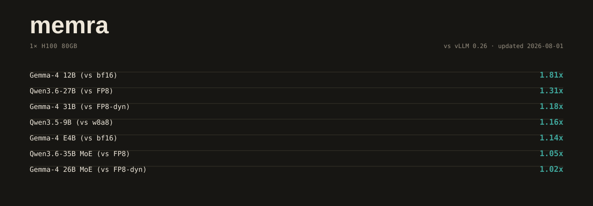

# memra performance — the tracked boards, mechanisms, history, receipts

This document carries the full tracked boards (generated from
[`research/tune-data/current-board.json`](../research/tune-data/current-board.json) by
[`tools/update-perf-board.py`](../tools/update-perf-board.py) — the README shows only a
few representative samples) and the depth behind them: how each cell moved, what was
refuted along the way, and where the raw runs live. The boards are a regression suite —
board-moving merges re-measure the tracked cells and regenerate every derived surface.
The measurement protocol is [`research/benchmarks.md`](../research/benchmarks.md);
competitor engines run at their swept best
([`docs/COMPETITOR-SETUP.md`](COMPETITOR-SETUP.md)); the H100 lane's append-only evidence
ledger — every promoted config, every mechanism refutation — is
[`ARCHITECTURE-H100.md`](../ARCHITECTURE-H100.md).

Every published median states its N and thermal regime; every perf claim is a same-session
interleaved pair (cross-run and cross-day comparisons are clock-drift-invalid, including the
competitor denominator). Locked-clock corollary (measured 2026-08-06, lane/prefill-gemm:
unlocked clocks drift 9% in-process, and 1860 MHz-locked absolute numbers read BELOW the
3090 MHz free-clock boost): a clock-locked value is the only valid A/B denominator, and
locked and free-clock numbers must never be mixed in one comparison.

> **Competitor benching is STOPPED (owner call, 2026-08-03).** Every llama.cpp and vLLM
> column in this document is a **frozen reference point** recorded on or before that date,
> kept as a regression anchor — not a live scoreboard. Forward work is self-competition
> (memra vs its own previous cells, and spec vs its own plain arm). Do not re-run a
> competitor to refresh a column here; do not read a ratio as a current-day claim. The
> doctrine banner also lives in [`research/benchmarks.md`](../research/benchmarks.md).
>
> One open counter-example that belongs in the same breath as the ratios below: on
> 2026-08-05, same model file / each engine at its owner's daily config / N=5 interleaved,
> **llama.cpp leads on cold time-to-first-token (0.19 s vs 0.53 s), short agentic turns, and
> raw prefill**, while memra leads long-generation sampled decode by +17%
> ([`research/memra-vs-llama-daily-20260805/`](../research/memra-vs-llama-daily-20260805/),
> labeled a dogfood diagnostic, not board material). memra makes **no interactive-latency
> superiority claim** while that stands. Since that measurement, the memra side of the
> latency stack has moved (all self-competition receipts, local 5090): round-cadence SSE
> takes solo first text 0.41 → 0.12 s and the admission-yield fix takes contended first
> text 1.60 → 0.15 s at any burst size
> ([`research/sse-cadence-20260805/`](../research/sse-cadence-20260805/),
> [`research/admission-20260806/`](../research/admission-20260806/)) — but the head-to-head
> itself has NOT been re-run (benching stopped), so the 0.53 s-vs-0.19 s row stays frozen
> as recorded.

> **Rig labels are load-bearing.** The *tracked boards* here are two rigs only: an **RTX 5090
> Laptop** (82 SM — the local rig, and the only owned GPU) and **rented H100 80 GB pods**.
> RTX PRO 6000 Blackwell Workstation cells (188 SM, rented pods) are deliberately *not* in
> those boards — they have their own section below, with their own rig label, because mixing
> a 188-SM cell with an 82-SM cell is a 2x-class error. The registry of every rig that
> produced a number in this repo is [Rigs](#rigs--what-was-measured-on-what) directly below.

## Rigs — what was measured on what

Every number in this repo belongs to exactly one of these. A cell moved to another rig is a
different number, not the same number re-measured: the same kernel is 5-12% apart between the
two PRO 6000 pod classes and roughly 2x apart between a 188-SM and an 82-SM board.

| Rig label | Hardware | Owned? | What it produces |
|---|---|---|---|
| **RTX 5090 Laptop** | GB203, 82 SM, 858 GB/s, local | **The only owned GPU** | The tracked 5090 board; the default-flip gate — no runtime default ships without re-running correctness/memory/throughput here |
| `pro6000wk-runpod` | RTX PRO 6000 Blackwell Workstation 96 GB, 188 SM, 600 W, clocks pinned 2865 MHz, zero throttle | Rented pod | The 27B serving cells below |
| `pro6000wk-runpod-community` | Same SKU, community-tier pod | Rented pod | Dev/iteration. Runs **5-11% slower** than the prod pod — never quote a community absolute next to a prod absolute; use relative deltas within one pod |
| `rig2x5090-serve` | vast.ai 2x RTX 5090 32 GB (single card used) | Rented | The official-FP8 checkpoint lane. Also the multi-card measurement platform and the small-SKU serving-shape reference |
| rented H100 80 GB | 8x / 3x / 1x HBM3 pods | Rented | The H100 board, the replica fleet, QoS lanes, endurance |
| AWS G7e | PRO 6000 Server Edition | Rented | Hy3 spill / quantization research (`docs/HY3-SPILL.md`) |

**No datacenter or desktop card is owned.** Any sentence about running on a PRO 6000 needs
the word "rented" or "pod" in it. The owned build-out targets that same silicon class
(owner override 2026-08-03, RTX PRO 6000 Blackwell class homogeneous rather than 2x5090 —
`research/hw-growth-rethink-20260803/ASSESSMENT.md` §"OWNER OVERRIDE"); nothing is purchased,
so *"measured on RTX PRO 6000 Blackwell (rented pod)"* is the only accurate present tense.
The local 5090 Laptop is the **measuring and gating rig**, not the final performance target;
2x5090 is dead as an owned purchase but alive and load-bearing as a rental platform. Two
hardware studies (`research/hw-growth-rethink-20260803/`, `research/hw-buy-20260802/`) still
carry their pre-override 2x5090 first-box recommendation un-struck, by design — a research
dir records what was recommended on its date. Do not read a first-box recommendation out of
either file.

## The 27B serving board (RTX PRO 6000, rented pod)

Rig `pro6000wk-runpod`, date **2026-08-04**, commit `2299ee0f`, temp max 43 C, zero throttle.
Two artifacts, both Qwen3.6-27B, interleaved in one session: **nv** =
`Qwen3.6-27B-NVFP4-Q4_K_M-mtp.gguf` (15.7 GB), **q8** = `Qwen3.6-27B-Q8_0.gguf` (28.6 GB).
Receipts: [`research/pro6000-prod-20260804/`](../research/pro6000-prod-20260804/), journal
`pro6000wk-runpod.jsonl`.

| Cell | Value | Protocol |
|---|---|---|
| Spec decode (MTP) K=3, nv, **bare CLI** | **186.7 tok/s** | N=5 process reps, median. 2.17x the same-run plain 86.20 |
| Spec decode K=3, nv, **through the serve surface** at c=1 | **170.5 tok/s** | N=5 median, server restarted per K, 0 err / 0 shed |
| Plain decode tg128, nv / q8 | 86.8 / 52.6 tok/s | N=5 medians |
| Aggregate at c=8, nv / q8 | **420.6** / 308.7 tok/s | N=3 passes, median; p50 2.42 s, 64 ok / 0 shed / 0 err per pass. Spec off, plain batched serve |
| TTFT cold, nv / q8 | **0.182** / 0.156 s | N=5 with per-rep `cache_salt`; median of reps 2-5, rep 1 excluded as one-time session warmup |
| TTFT warm (prefix hit), nv / q8 | 0.003 / 0.004 s | reps 2-5; 61x the cold number |
| Prefill pp512, nv / q8 | 4118 / 4591 tok/s | N=5, arms interleaved within every rep |
| Q8 96 GB residency lever | +57% agg at c=16/32 (486 vs 310 tok/s, p50 6.61 → 4.21 s), 63.7 GB resident | `q8rp/` |

Caveats that travel with these cells:

- **c=8 is the knee; saturation is not a win.** c8 420.6 → c16 421.9 → c32 423.0 is flat
  *while p50 doubles at every step* (2.43 → 4.84 → 9.67 s). The journal's own word for
  c16/c32 is "queueing, not throughput." c=32 is not a throughput ceiling.
- **The TTFT protocol trap.** An unsalted repeat request hits the prefix cache, so a TTFT
  number measured without a fresh `cache_salt` is a warm number wearing a cold label. Cold
  and warm are always stated separately.
- **These TTFT rows predate the felt-latency fixes** (round-cadence SSE 2026-08-05 +
  admission yield 2026-08-06). The rows above measure time to the first *token* on a plain
  request and stand as recorded; what changed is first *streamed text* on the spec tier —
  solo 0.41 → **0.12 s**, contended 1.60 → **0.15 s** at any `MEMRA_SPEC_BURST`, measured
  N=5 on the local 82-SM rig (27B NVFP4+MTP;
  [`research/sse-cadence-20260805/`](../research/sse-cadence-20260805/),
  [`research/admission-20260806/`](../research/admission-20260806/)). This board's rig has
  not re-measured them; do not mix the two rigs' latency numbers.
- **4118 and 4591 are two different artifacts**, not two configs of one.
- **Never present a single rep as the headline.** 170.6188 is the r4 rep; the N=5 median is
  170.55. 421.18 is the p1 pass; the N=3 median is 420.57.

Gate battery on that rig: `kernel-check` **ALL GREEN** naked (184 `OK`) and model-backed on
real 27B weights (263 `OK`); `run-gen` argmax **MATCH** both artifacts; `run-spec`
self-consistency **PASS** at K=1,2,3. **Do not say "K=1..8" about this rig** — the prod board
ran K=1..3 as a gate plus K=4/5 as perf cells. The full K=1..8 PASS battery lives on the
community board, on the NVFP4-MTP artifact
(`research/q27-deepdive-20260805/logs/gate-key48-runspec-K1to8.log`); Q8_0 cannot run it at
all (no MTP head, `RUNSPEC-Q8 rc=2`). The accurate form is "K=1..8 self-consistency is a
standing gate, run on the MTP-capable artifact."

### Official FP8 checkpoint — the 2.6x spec cell (a different rig)

Rig `rig2x5090-serve`, date **2026-08-04**, CUDA 13.0.1 / nvcc 13.0.88. Model: the official
`Qwen/Qwen3.6-27B-FP8` safetensors checkpoint (29 GB, e4m3, `weight_block_size [128,128]`,
407 block-128 scale grids). Receipts:
[`research/fp8ship-20260804/official/`](../research/fp8ship-20260804/official/).

| Arm | tok/s | vs plain |
|---|---|---|
| ST plain | 48.99 | — |
| **ST spec, the checkpoint's own embedded MTP head** | **128.06** | **2.61x** |
| ST spec + own-trim drafter | 136.75 | 2.79x |
| ST e4m3 resident | 48.99 | flat *by construction* |

N=5 medians per arm, SSE `/v1/chat/completions`, greedy, max_tokens 128, pp512-class prompt,
fresh `cache_salt` per request with `cached_tokens=0` verified every rep, arms sequential in
one session, 32-44 C. Bit-identity on the official artifact: argmax 365==365, maxdiff 0.0 x3,
prefill logit vectors **bit-identical 993280/993280 bytes**. Load wall 843.9 → 291.6 s =
**2.89x** (N=3 interleaved).

The e4m3 arm is flat *because* every tensor on this checkpoint is block-128 and falls through
to the Q8_0 path — the win here is load time, not tok/s. Spec **triples TTFT** on this arm
(0.170 → 0.466 s). The GGUF Q8_0 reference row (53.63) is cross-protocol and cross-day, not
apples-to-apples. **There is no official-FP8 measurement on any PRO 6000** — do not merge the
two boards.

## Standing (2026-08-05)

Ten supported models on the 5090 Laptop, all fully gated; MTP-spec cells run 1.06–2.3x the
frozen llama.cpp references (one Gemma near-parity cell, 0.98x, still open), plain cells sit
at the DRAM wall or above.
Newest in: **Qwen-AgentWorld-35B-A3B** (#10, best-vs-best e2e 1.68/1.76/1.75x on the
UD-IQ4_XS re-pick). Just before it, **Ornith-1.0-35B** (#9) — AUTO-KQUANT (k-quant expert
banks join the grouped-f16 prefill lane by default: board-2048 prefill 3.14x) stacked on
resident-if-fits residency, and its own-gen drafter cleared the deployment bar on every
prompt class (best-vs-best e2e 1.31/1.14/1.12x,
[`research/q4k-expert-prefill-20260802/`](../research/q4k-expert-prefill-20260802/)).
On the H100, a full per-model board against vLLM 0.26 (frozen 2026-08-01): **no end-to-end
losses** — seven wins of seven (1.02–1.81x); decode wins 7 of 7. Multi-user serving measured
on 3 rented H100s: 1,477 tok/s managed fleet, chaos-tested. Trimmed MTP drafter heads are
published ready-to-use at
[huggingface.co/Avifenesh/memra-bench](https://huggingface.co/Avifenesh/memra-bench).

The **plain-serve c=1 gap (task #70) closed 2026-08-05**: `MEMRA_SERVE_B1FAST` routes a solo
serve tick through the m=1 fused trunk (+8.33% q9 / +5.19% q27 decode-only at c=1, N=5
order-paired, 5/5 wins each; serve c=1 now level with the same-board `run-gen` denominator
on the 82-SM rig — see [Serving performance](#serving-performance)). Still open: the NVFP4
**spec** serve path (−8.66% pre-fix, its burst loop is a separate path) and the
interactive-latency gaps in the banner above. Both are tracked as gaps, not hidden.

## The serving exactness arc — a defect the discipline caught

The batched F32 prefill router GEMM was m-dependent, so under cross-request prefill batching
a MoE request's own expert routing could change with its co-arrivals — a real serving defect.
Scale of the defect, pre-fix: **121 of 760 (15.9%) `(layer, token)` pairs picked a different
expert *set*** depending on who arrived in the same batch (Ornith-1.0-35B Q4_K_M at
total_m=75, arm `exact0`), plus 217 more differing in order only.
The fix routes prefill through the decode path's m-invariant router/gate kernels
(`MEMRA_ROUTER_PREFILL_EXACT`, default ON), and a bit-identical batched twin then recovered
70% of the prefill it cost. The serving contract — greedy serving is isolated-identical under
concurrent load at defaults; a request's tokens never depend on its co-arrivals — is now
explicit and gated, not assumed: the serve gate replays the same prompts at c=1 and c=16 and
byte-compares every stream (16/16 on all four models post-fix; 7/16 and 6/16 with
`MEMRA_ROUTER_PREFILL_EXACT=0`, which is how the defect was found). Note the object: this is
**serve-vs-serve at c=1 vs c=16**, not identity against a single-token oracle — the
batched-plain path carries a documented, bounded near-tie flip class
([`research/plainbatch-20260804/`](../research/plainbatch-20260804/)) and first-token
cross-config drift is a separate class again (docs/SERVING.md). Receipts:
[`research/concat-prime-exact-20260802/`](../research/concat-prime-exact-20260802/),
[`research/fast-router-20260802/`](../research/fast-router-20260802/).

The H100 35B cell tells the arc in one row: it slipped from 218/1.02x to dead-even when the
concat-prime fix landed (m-invariant prefill router + shexp gates, −13% Hopper expert
prefill) so a session's routing no longer depends on its co-arrivals — then a bit-identical
batched twin of the exact kernel recovered 82% of that cost (8136 pp2048,
kernel-check-pinned mism=0; `MEMRA_ROUTER_BATCH=0` is its perf-only rollback seam) and the
row reached 217/1.01x, ahead again with the contract held — then jumped to 226/1.05x when
direct-from-quant tile loaders reached ~100% of the expert bank (IQ4_XS/IQ3_S added to
Q4_K/Q6_K) and the single-kernel grouped GEMM flipped past cublas as the Hopper default
(round 55: mode-2 prime 13164 vs cublas 8627 tok/s, +52.6% interleaved x5, bit-identical
tiles by construction; expert prefill 8136 → 13258 on the row). Decode never moved; the
dense 27B row was never on the path (re-cell bit-stable). Receipts:
[`research/router-fix-recells-20260802/`](../research/router-fix-recells-20260802/),
[`research/fast-router-20260802/`](../research/fast-router-20260802/),
[`research/q35-recell-final-20260802/`](../research/q35-recell-final-20260802/),
[`research/h100-flip-full-20260802/`](../research/h100-flip-full-20260802/).

## RTX 5090 Laptop — tracked cells, vs the frozen llama.cpp reference

Single-user decode on the local **RTX 5090 Laptop** (82 SM); both engines interleaved on the
same rig, same prompts. The llama.cpp columns are **frozen reference denominators** recorded
through 2026-08-03 (benching stopped that day) — regression anchors, not a live scoreboard.

**Plain decode** (no speculation, tg128 at 512-token context):

<!-- PERF-PLAIN:START (generated by tools/update-perf-board.py — do not hand-edit; edit research/tune-data/current-board.json instead) -->
| Model | memra plain | llama.cpp plain | Ratio |
|---|---|---|---|
| Qwen3.5-9B NVFP4 (GGUF) | 137.3 | 121.2 | **1.13x** |
| Qwen3.6-27B NVFP4 (GGUF) | 47.6 | 43.7 | **1.09x** |
| Qwen3.6-35B-A3B MoE (IQ4_XS) | 187.0 | 164.9 | **1.13x** |
<!-- PERF-PLAIN:END -->

**Speculative decoding** (MTP head, both at their measured best; columns = short code /
medium code / long agentic prompt classes):

<!-- PERF-SPEC:START (generated by tools/update-perf-board.py — do not hand-edit; edit research/tune-data/current-board.json instead) -->
| Model | memra spec | llama.cpp spec-best | Ratio |
|---|---|---|---|
| Qwen3.5-9B (K=3 + own-gen trimmed draft) | 281.0 / 211.7 / 187.1 | 122.2 / 121.5 / 117.7 | **2.30x** / **1.74x** / **1.59x** |
| Qwen3.6-27B (K=3 + own-gen trimmed draft) | 116.4 / 101.2 / 86.0 | 91.7 / 93.3 / 81.5 | **1.27x** / **1.08x** / **1.06x** |
| Qwen3.6-35B-A3B (K=2 + own-gen trimmed draft) | 302.4 / 253.0 / 270.7 | 234.7 / 207.2 / 235.8 | **1.29x** / **1.22x** / **1.15x** |
<!-- PERF-SPEC:END -->

<details><summary>Measurement provenance</summary>

<!-- PERF-DATE:START (generated by tools/update-perf-board.py — do not hand-edit; edit research/tune-data/current-board.json instead) -->
Measured 2026-08-02 on the tracked measuring rig (RTX 5090 Laptop, N=2+ medians, both engines interleaved in the same thermal window on the same rig, same exact prompts, no flags (tuned paths are defaults); plain/depth rows re-measured 2026-08-02 after the deep fa_decode merge (d14d7d8d) — N=5 same-session interleaved medians, fresh llama denominator, research/board-remeasure-20260802/ — spec rows re-paired 2026-07-18 (35B spec row re-paired 2026-08-02 under the mode-2 grouped-f16 naked default — sk visitor + direct expert tiles — N=3 medians, research/f16g-default-rearb-20260802/), Gemma card rows from the 2026-07-15 best-vs-best re-audit. Full per-run logs: research/tune-data/ (Qwen) and research/gemma4-bringup/ (Gemma) — every win and every loss; Gemma 12B plain row from the 2026-07-24 official N=5 cell stamp (research/gemma4-bringup/g12tg-cellstamp.log)) against llama.cpp built on the same machine, same exact prompts, both engines re-baselined the same day. The llama.cpp columns are frozen reference points recorded through 2026-08-03, when head-to-head benching stopped (owner call) — regression anchors, not a live scoreboard. Boards move with the tuning campaign — `research/tune-data/rig5090.jsonl` is the running record; the generated boards (README samples + this document) are refreshed with every board-moving merge.
<!-- PERF-DATE:END -->

</details>

### Depth behavior

Depth is part of the contract: at 6.3k-token context every plain-decode lead holds
(1.11–1.13x, 2026-08-02 post-deep-fa re-measure — the depth cells are where the deep
fa_decode rewrite lands hardest, 35B +8.2% at d6257). The depth rows live in
`current-board.json` (`plain_decode_depth`), re-measured N=5 same-session interleaved
with a fresh llama denominator (`research/board-remeasure-20260802/`).

### Prefill, root-caused — and still open

5090 prefill trails llama.cpp (0.59–0.78x), root-caused: llama benches NVFP4 prefill at
W4A4 (FP4 activations), a numeric class memra's exactness gates reject. Output quality
outranks the prefill column — but the numerics explanation does not close the gap, and the
2026-08-05 dogfood run measured the same shape on an identical model file (4k prefill 1.2k
vs 2.1k tok/s). Prefill remains an open lane, not a settled trade.

### Speculative protocol notes

The three spec columns are three prompt classes: short code / medium code (greedy) / long
agentic (temp 0.7, distribution-exact rejection sampling). One asterisk: the 35B short-code
llama bar is an EOS-suppressed continuation (the raw short prompt EOSes at 1 token)
and is not a clean win basis. Every spec row uses one trimmed draft built by the standard
regime ([`docs/DRAFT-REGIME.md`](DRAFT-REGIME.md)); prebuilt drafts live in the
[bench repo](https://huggingface.co/Avifenesh/memra-bench), or build your own:

```bash
./target/release/frspec-owngen model.gguf ranks.gguf 32768        # ranks from the model's OWN generations
tools/make-trimmed-draft.sh model.gguf ranks.gguf.txt draft.gguf  # extract + trim + quantize
```

### Gemma-4 (QAT Q4_0)

Same protocol, own campaign log
([`research/gemma4-bringup/rig5090-gemma4.jsonl`](../research/gemma4-bringup/rig5090-gemma4.jsonl));
cells re-paired best-vs-best with llama's own draft depth swept per cell. Highlights
(full tables and the per-cell archaeology live in the campaign log). Hand-written table —
these cells are **not** in `current-board.json`, and their llama column is frozen at the
2026-07-15 best-vs-best re-audit:

| Cell | memra | llama.cpp (frozen ref) | Ratio |
|---|---|---|---|
| 12B MTP spec, 1.7k ctx (K=4 + own-gen trim) | 269.3 | 175.1 | **1.54x** |
| 12B MTP spec, chat (K=4 + own-gen trim) | 240.9 | 172.4 | **1.40x** |
| 31B MTP spec, chat (K=5 + own-gen trim) | 124.3 | 99.0 | **1.26x** |
| 31B MTP spec, 1.7k (K=6 + FR trim) | 97.3 | 83.9 | **1.16x** |
| 26B MTP spec, short ctx (K=4 + own-gen trim) | 328.1 | 298.0 | **1.10x** |
| E4B plain, short | 199.9 | 181.0 | **1.10x** |
| 26B plain, 4.9k ctx | 162.6 | 142.0 | 1.14x |
| plain decode elsewhere | — | — | 1.00–1.07x |

What buys the margins: an FP8 (e4m3) KV cache, occupancy-tuned attention tiles, wide-load
Q4_0 expert dots, FR-Spec drafter trims (150 MB → 18 MB at unchanged acceptance), a
per-model adaptive-K floor (+20% on 12B/31B spec at unchanged exactness), and an in-round
draft-confidence cut. One near-parity cell remains (26B 1.7k spec, 0.98x). Gemma plain
margins are thin where both engines sit at the DRAM wall (1.02–1.06x). Exact prompts and
llama.cpp's swept-best flags: [`docs/COMPETITOR-SETUP.md`](COMPETITOR-SETUP.md).

### Ornith-1.0-9B (Q8_0)

Supported model #8, and the first community post-train to clear the deployment bar
(best-vs-best e2e ≥ 1.1x on every prompt class). Each engine at its measured best on the
same GGUF: memra runs the regime drafter at K=3 (donor-block own-gen trim — the published
model ships no MTP head, [`docs/DRAFT-REGIME.md`](DRAFT-REGIME.md)); llama.cpp's best is
plain — its draftless speculative doors are structurally broken on this arch (M-RoPE
position faults, screened in the receipts). Interleaved N=3 medians, same session
([`research/ornith-bar-20260802/`](../research/ornith-bar-20260802/)):

| Prompt class | memra e2e, 256 tok (spec K=3) | llama.cpp e2e (plain best) | Ratio |
|---|---:|---:|---:|
| code short | 1.395 s | 3.084 s | **2.21x** |
| code medium (1.8k ctx) | 2.050 s | 3.429 s | **1.67x** |
| agentic long (6.3k ctx) | 2.984 s | 4.376 s | **1.47x** |

Spec-vs-own-plain: 2.16/1.77/1.70x at 47-61% acceptance
([`research/ornith-drafters-20260801/`](../research/ornith-drafters-20260801/)); build the
drafter with the standard two commands in [`docs/DRAFT-REGIME.md`](DRAFT-REGIME.md)
(donor-block variant — donor pairs and receipts documented there).

### Ornith-1.0-35B (Q4_K_M MoE)

Supported model #9. A three-lane arc took it over the bar: resident-if-fits residency
(the 19.5 GB expert bank fits 24 GB — +50% decode over the old spill default), the
adopted own-gen donor-block drafter (K=2, 60-68% acceptance), and grouped-f16 expert
prefill (the Q4_K/Q6_K bank rides the grouped-f16 lane by default — AUTO-KQUANT then,
the mode-2 default now, same dispatch for this bank: board-2048 prefill 3.14x, pp512 +54%,
decode flat). Best-vs-best per class (memra = spec K=2; llama.cpp = plain, its measured
best on this arch); interleaved N=3, same session
([`research/q4k-expert-prefill-20260802/`](../research/q4k-expert-prefill-20260802/)):

| Prompt class | memra e2e, 256 tok (spec K=2) | llama.cpp e2e (plain best) | Ratio |
|---|---:|---:|---:|
| code short (27 tok) | 1.033 s | 1.357 s | **1.31x** |
| code medium (1.8k ctx) | 1.618 s | 1.837 s | **1.14x** |
| agentic long (6.3k ctx) | 2.738 s | 3.053 s | **1.12x** |

The honest residual: short-prompt prefill (pp512 0.42x llama) — the per-pass k-quant → f16
dequant cost amortizes with prompt length (0.91x at 2048, a 1.06x memra win at 6.3k); the
no-dequant kill (Q4_K/Q6_K expert MMQ tile loaders) is priced, not built. Plain decode runs
1.086x.

### Qwen-AgentWorld-35B-A3B (UD-IQ4_XS MoE)

Supported model #10 — same stack as Qwen3.6-35B-A3B by construction (header bytes
verified), gated and benched on the UD-IQ4_XS re-pick. Best-vs-best e2e per class 1.68x /
1.76x / 1.75x (interleaved N=3 medians, spec K=2 own-gen drafter at 66-87% acceptance,
plain prefill 1.9-3.5x; [`research/agentworld-iq4xs-20260802/`](../research/agentworld-iq4xs-20260802/)).
Quant guidance: use UD-IQ4_XS — the UD-Q4_K_M repack's Q5_K expert mix sits outside
fast-path coverage.

## H100 (rented) vs the frozen vLLM 0.26 reference



Rig: **1x H100 80 GB, rented pod** — no H100 is owned. The vLLM column is a frozen
reference recorded 2026-08-01.

<!-- PERF-H100:START (generated by tools/update-perf-board.py — do not hand-edit; edit research/tune-data/current-board.json instead) -->
Measured 2026-08-01 on 1× H100 80GB against vLLM 0.26 — same box, every cell a same-session interleaved pair. One number per arm: end-to-end tok/s — 512 tokens generated on a ~2100-token real-text prompt, single request, total wall time; N=5 medians, argmax exactness gate green on every published row. Cross-artifact by design: vLLM serves what H100 users deploy (w8a8 / FP8-dynamic / bf16 HF checkpoints — it rejects these GGUFs); memra serves its GGUF artifacts.

| Model | memra e2e | vLLM 0.26 e2e (artifact) | Ratio |
|---|---:|---:|---:|
| Gemma-4 12B | **146** | 81 (bf16) | **1.81x** |
| Qwen3.6-27B | **96** | 73 (FP8) | **1.31x** |
| Gemma-4 31B | **75** | 64 (FP8-dyn) | **1.18x** |
| Qwen3.5-9B | **204** | 176 (w8a8) | **1.16x** |
| Gemma-4 E4B | **193** | 168 (bf16) | **1.14x** |
| Qwen3.6-35B MoE | **226** | 215 (FP8) | **1.05x** |
| Gemma-4 26B MoE | **196** | 191 (FP8-dyn) | **1.02x** |
<!-- PERF-H100:END -->

*The bf16-row wins carry a quant advantage — those vLLM arms move ~4x the weight bytes;
the e2e board is loss-free because decode wins 7 of 7.*

### Flip history

The last e2e losses fell in two days. The two MoE expert-prefill cells closed in round 49:
the 35B when the grouped f16 expert lane reached full dequant coverage and became the
Hopper default (expert prefill +53%) — then +63% more at round 55 when direct-from-quant
tile loaders covered the whole bank and the in-house grouped kernel flipped past cublas —
and the 27B via K-quant f16 prefill mirrors (+54% pp2048) plus split-plane decode mirrors
(+16% decode, bit-identical). The 26B cell flipped from dead-even to a win in round 50,
when a cross-box interleaved arbitration caught that same f16g default *regressing* the
gemma expert class −6 to −8% and narrowed it per-model — the board is tuned per dispatch
class, not per flag. The last two decode losses fell to the shexp fused dot and a
router-default re-arbitration on real prompts.

### Refuted: a Q8_0-exact int8 GEMM on Hopper

Per-cell prefill still trails vLLM on the dense models — the int8-GEMM dtype edge: a
Q8_0-exact int8 GEMM is mechanism-refuted on Hopper (per-32-block rescale costs 5.4x naive
/ 17x pipelined; ptxas serializes cross-bank GMMA register reads), so crossing it means
w8a8-class numerics that change model outputs — an accuracy-bar decision with measured
receipts, not an engineering unknown. The e2e board stays loss-free because decode wins
7 of 7 and dominates the p2048/g512 shape. Full refutation ledger:
[`ARCHITECTURE-H100.md`](../ARCHITECTURE-H100.md).

### Shipped on the sm_90a build

FA3-class prefill attention (TMA swizzled ring + wgmma, 4.8x the mma kernel), fused wgmma
GDN chunk kernels with varlen twins, f16 prefill mirrors on the cuBLASLt lane for the
Q8_0/Q4_0/Q4_K/Q5_K/Q6_K classes, K-quant split-plane decode mirrors (bit-identical layout
v2, 27B decode +15-16%), the grouped f16 expert lane (one single-kernel grouped GEMM over
the routed experts with direct-from-quant Q4_K/Q6_K/IQ4_XS/IQ3_S tile loaders and a 3-stage
deep tail — Hopper default for the qwen/silu MoE class, 35B expert prefill +53% at round 49
and +63% again at round 55 when it flipped past cublas; per-model off for the gemma class
after the round-50 regression arbitration), a batched serving decode tick (z-batched
attention + KV append, device-side sampling, lean logits: 654-659 tok/s/replica, +25-36%),
an MTP speculative serving fast lane (1.82x plain serving at c=1 on the 27B), cross-request
prefill batching, per-session CUDA-graph decode with kernel-class segment recapture, and
the Hopper wgmma toolkit
([`cu/wgmma_common.cuh`](../crates/memra-engine/cu/wgmma_common.cuh)) — canonical
core-matrix pairings probed for bf16/tf32/s8: one byte-geometry, three MMA kinds.

- Evidence ledger (every verdict and refutation): [`ARCHITECTURE-H100.md`](../ARCHITECTURE-H100.md)
- Flags + promoted defaults: [`docs/FLAGS.md` §7](FLAGS.md)
- One-command battery: `tools/validate-h100.sh <model.gguf> [--quick]`

## Serving performance

Batched decode runs one z-batched tick across sequences, chunked 16-wide on models with a
bit-exact 16-batch kernel class: +18.8% at c=16 on a 5090 Laptop single replica (same-mirror
interleaved N=4); 654-659 tok/s/replica on the rented-H100 serving tick (+25-36%). Greedy
serving is isolated-identical under concurrent load at defaults (m-invariant prefill
router/gate kernels, serve-gate c=1-vs-c=16 byte identity — serve-vs-serve, not identity
against a tokenwise oracle). Multi-GPU boxes serve as a replica fleet — supervisor +
admission proxy + load harness, measured at 1,477 tok/s managed on 3 rented H100s,
chaos-tested: kill a replica mid-load and the breaker + supervisor recover in seconds with
only in-flight requests lost. Endurance: 140 minutes at c=96 on 8 rented H100s, 464,870
requests, 0 errors, 0 sheds, +0.045% throughput drift — a **9B-class** (Qwen3.5-9B-Q8_0)
warm-prefix result whose load ran at temp 0.7 seeded, with a separate greedy probe hashing
identical on all 8 replicas before and after. Runbook: [`docs/SERVING.md`](SERVING.md).

**The plain-serve c=1 gap (task #70) — CLOSED 2026-08-05, serve-path phase 2.** Phase 1
measured serve c=1 at −11.74% vs the naked CLI on a Q8_0 27B cell (`memra-server` 46.09
tok/s N=3 median vs `run-gen` 52.22 single run, rig `pro6000wk-runpod-community`); the
measured cause was that the worker routed B=1 through the batched decode body, missing the
m=1 fusion chain. The fix (`MEMRA_SERVE_B1FAST`, default ON) routes a `b_n==1` tick through
`decode_layers_eager` verbatim: **+8.33% q9 / +5.19% q27** decode-only at c=1 (N=5
order-paired, 5/5 wins each, c=8 flat), bit-identical to `decode_step_h` (strict gate1
PASSes with it ON and FAILed without), and serve c=1 now sits level with the same-board
`run-gen` denominator on the 82-SM rig. The 188-SM phase-1 cell has not been re-measured
post-fix; the pre-fix −11.74% is history, not a current number. **Still open:** the NVFP4
**spec** serve path (−8.66% pre-fix: 170.55 serve vs 186.72 bare, rig `pro6000wk-runpod`)
— the spec tier's burst loop is a separate path the fast path does not touch. Receipts:
[`research/q27-deepdive-20260805/PHASE2-SPEC.md`](../research/q27-deepdive-20260805/PHASE2-SPEC.md)
(phase 1), [`research/servepath-p2-20260805/`](../research/servepath-p2-20260805/) (the
fix + the graph-door refutation). The published boards above are **bare-CLI** numbers; do
not read them as serve-path numbers.

## Bring-up notes

- **KAT-Coder-V2.5** — onboarded with zero code change (native `qwen35moe` arch strings;
  argmax + chat gates green — [receipts](../research/onboard-ornith-20260801/)). Decode
  anomaly RESOLVED: its IQ4_XS trunk was riding the f32 oracle path; default dp4a admission
  moved decode +81% to llama parity (1.016x) and flipped its drafter net-positive on
  code-short (1.25x e2e @K=2). The bar-binding gap is now prefill alone (0.169x — the
  IQ4_XS-trunk MMQ port is priced, [receipts](../research/kat-anomaly-20260802/)).
- **Hy3 Layer103.5 overlay** — VRAM→RAM→dual-NVMe spill, correctness-gated end-to-end;
  serves at a 5.13 tok/s N=3 median, tuning toward 10
  ([`docs/HY3-SPILL.md`](HY3-SPILL.md)).
- **MiniMax-M3 REAP50** — safetensors spill; loads + generates, router tuning open.
